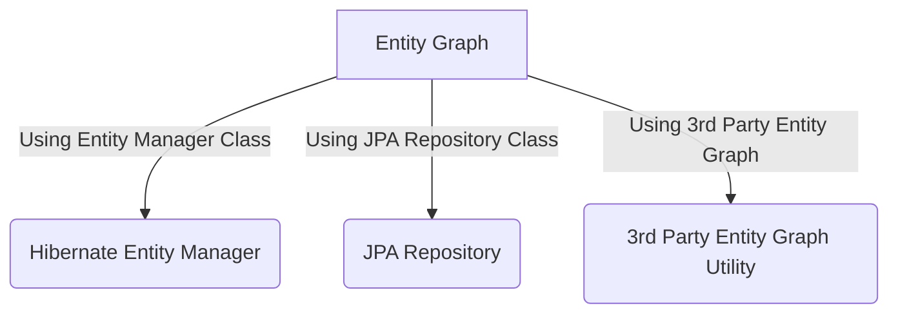
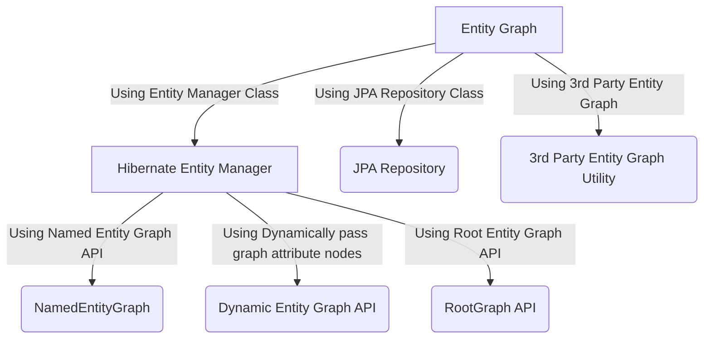
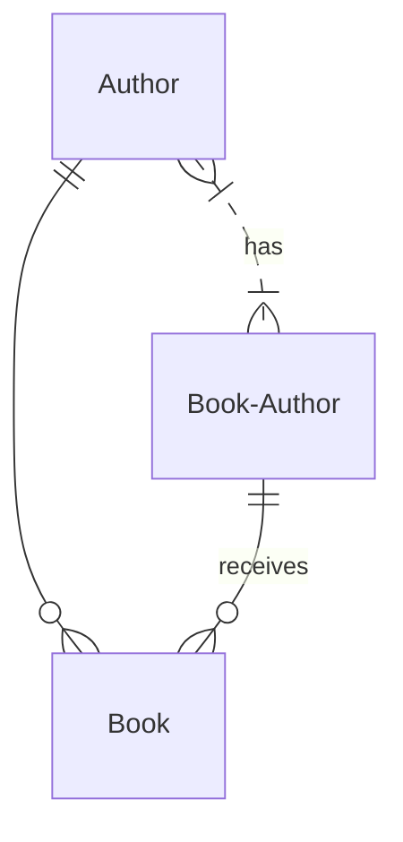

# Hibernate Entity Graph
 In Hibernate/JPA we face N+1 Problem. First we will see what is the N+1 Problem.
 
 In order to find, what is N+1 Problem Please go through the below stackoverflow link
 
 https://stackoverflow.com/questions/32453989/what-is-the-solution-for-the-n1-issue-in-jpa-and-hibernate?noredirect=1&lq=1
   
 We can fix N+1 select problem by using Entity Graphs provided by JPA 2.1. we can achieve following ways. 
 
 - Using Entity Manager
 - Using JPA Repository
 - Using 3rd Party Entity Graph Utility
  

In this example we will use Hibernate Entity Manager to solve N+1 problem.

### DB Design

