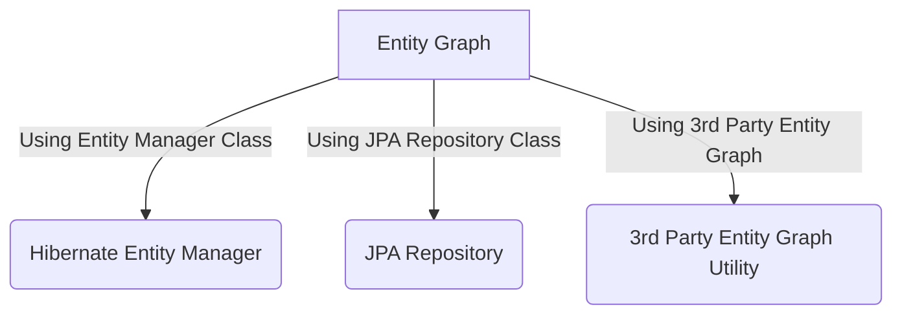
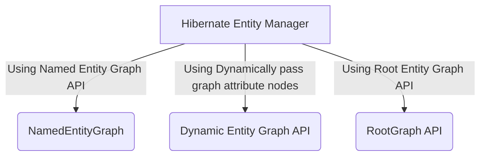

# Hibernate Entity Graph
 In Hibernate/JPA we face N+1 Problem. First we will see what is the N+1 Problem.
 
 In order to find, what is N+1 Problem Please go through the below stackoverflow link
 
 https://stackoverflow.com/questions/32453989/what-is-the-solution-for-the-n1-issue-in-jpa-and-hibernate?noredirect=1&lq=1
   
 We can fix N+1 select problem by using Entity Graphs provided by JPA 2.1. we can achieve it in the following ways. 
 
 - Using Entity Manager
 - Using JPA Repository
 - Using 3rd Party Entity Graph Utility
  



In this example we will use `Hibernate Entity Manager` to solve N+1 problem.



### DB Design


## Without Entity Graph
```java
	EntityManager entityManager = getEntityManager();
	Author author = entityManager.find(Author.class, 1);
	System.out.println(author.getFirstName()+" "+author.getLastName()+" wrote "+author.getBooks().size()+" books.");
	Set<Book> books = author.getBooks(); 
	for(Book book: books) {
	  System.out.println(book.getPublisher()); 
	}
	
```
We can notice when I tried to access author, books and publisher, it issues 3 queries to fetch the data.

```log
19:22:24,828 DEBUG [org.hibernate.SQL] - 
    select
        author0_.id as id1_0_0_,
        author0_.first_name as first_na2_0_0_,
        author0_.last_name as last_nam3_0_0_,
        author0_.version as version4_0_0_ 
    from
        author author0_ 
    where
        author0_.id=?

19:22:24,867 DEBUG [org.hibernate.SQL] - 
    select
        books0_.author_id as author_i2_2_0_,
        books0_.book_id as book_id1_2_0_,
        book1_.id as id1_1_1_,
        book1_.publisher_id as publishe5_1_1_,
        book1_.publishing_date as publishi2_1_1_,
        book1_.title as title3_1_1_,
        book1_.version as version4_1_1_ 
    from
        book_author books0_ 
    inner join
        book book1_ 
            on books0_.book_id=book1_.id 
    where
        books0_.author_id=?

Joshua Bloch wrote 1 books.

19:22:24,887 DEBUG [org.hibernate.SQL] - 
    select
        publisher0_.id as id1_3_0_,
        publisher0_.name as name2_3_0_,
        publisher0_.version as version3_3_0_ 
    from
        publisher publisher0_ 
    where
        publisher0_.id=?

Publisher name: Addison-Wesley Professional

```

## Named Entity Graph

### Entity Class (declaring Named Entity Graph as below)

```java
@Entity
@Table(name = "author")
@NamedEntityGraph(name = "graph.author.books.publisher", 
	attributeNodes = @NamedAttributeNode(value = "books", subgraph = "books"),
	subgraphs = @NamedSubgraph(name = "books", attributeNodes = @NamedAttributeNode("publisher"))    )

@NamedEntityGraph(name = "graph.author.books", attributeNodes = @NamedAttributeNode(value = "books"))

public class Author {

	@Id
	@GeneratedValue(strategy = GenerationType.IDENTITY)
	private Integer id;

	@Version
	private Integer version;

	@Column(name = "first_name")
	private String firstName;

	@Column(name = "last_name")
	private String lastName;

	@ManyToMany(mappedBy="authors",fetch = FetchType.LAZY)
	private Set<Book> books = new HashSet<Book>();

}

@Entity
@Table(name = "book")
public class Book {
	
	@Id
	@GeneratedValue(strategy = GenerationType.IDENTITY)
	private Integer id;

	@Version
	private Integer version;

	private String title;

	@Temporal(TemporalType.DATE)
	@Column(name = "publishing_date")
	private Date publishingDate;

	@ManyToOne(fetch = FetchType.LAZY)
	@JoinColumn(name="publisher_id")
	private Publisher publisher;

	@ManyToMany
	@JoinTable(
		      name="book_author",
		      joinColumns={@JoinColumn(name="book_id", referencedColumnName="id")},
		      inverseJoinColumns={@JoinColumn(name="author_id", referencedColumnName="id")})
	private Set<Author> authors = new HashSet<Author>();
	
}

@Entity
@Table(name = "publisher")
public class Publisher {

	@Id
	@GeneratedValue(strategy = GenerationType.IDENTITY)
	private Integer id;

	@Version
	private Integer version;

	private String name;

	@OneToMany(mappedBy = "publisher")
	private Set<Book> books = new HashSet<Book>();
	
}		

```

### Named Entity Graph Testing Here

In this example we are using `@NamedEntityGraph` name attribute `graph.author.books` to get entity graph api. 
It will load only Book objects but not publisher associate with books

```java

	EntityManager entityManager = getEntityManager();
	String hql = "SELECT a FROM Author a WHERE a.id = 1";
	EntityGraph graph = entityManager.getEntityGraph("graph.author.books");
	TypedQuery<Author> query = entityManager.createQuery(hql, Author.class);
	query.setHint("javax.persistence.loadgraph", graph);
	Author author = query.getSingleResult();
    System.out.println(author.getFirstName()+" "+author.getLastName()+" wrote "+author.getBooks().size()+" books.");
	Set<Book> books = author.getBooks(); 
	for(Book book: books) {
	   System.out.println(book.getPublisher()); 
	}
```

we can notice that it issued only 2 queries to fetch data. This is because we included books as part of graph.

```log

19:27:38,472 DEBUG [org.hibernate.SQL] - 
    select
        author0_.id as id1_0_0_,
        book2_.id as id1_1_1_,
        author0_.first_name as first_na2_0_0_,
        author0_.last_name as last_nam3_0_0_,
        author0_.version as version4_0_0_,
        book2_.publisher_id as publishe5_1_1_,
        book2_.publishing_date as publishi2_1_1_,
        book2_.title as title3_1_1_,
        book2_.version as version4_1_1_,
        books1_.author_id as author_i2_2_0__,
        books1_.book_id as book_id1_2_0__ 
    from
        author author0_ 
    left outer join
        book_author books1_ 
            on author0_.id=books1_.author_id 
    left outer join
        book book2_ 
            on books1_.book_id=book2_.id 
    where
        author0_.id=1

Joshua Bloch wrote 1 books.

19:27:38,534 DEBUG [org.hibernate.SQL] - 
    select
        publisher0_.id as id1_3_0_,
        publisher0_.name as name2_3_0_,
        publisher0_.version as version3_3_0_ 
    from
        publisher publisher0_ 
    where
        publisher0_.id=?


Publisher name: Addison-Wesley Professional


```

In this example we are using `@NamedEntityGraph` name attribute `graph.author.books.publisher` to get entity graph api. 
It will load Book objects as well as publisher associate with books

```java

	EntityManager entityManager = getEntityManager();
	String hql = "SELECT a FROM Author a WHERE a.id = 1";
	EntityGraph graph = entityManager.getEntityGraph("graph.author.books.publisher");		
	TypedQuery<Author> query = entityManager.createQuery(hql, Author.class);
	query.setHint("javax.persistence.loadgraph", graph);
	Author author = query.getSingleResult();
	System.out.println(author.getFirstName()+" "+author.getLastName()+" wrote "+author.getBooks().size()+" books.");
	Set<Book> books = author.getBooks(); 
	for(Book book: books) {
	   System.out.println(book.getPublisher()); 
	}
```
we can notice that it issued only one query to fetch all data. This is because we included books and publisher as part of graph.

```log
19:31:18,884 DEBUG [org.hibernate.SQL] - 
    select
        author0_.id as id1_0_0_,
        book2_.id as id1_1_1_,
        publisher3_.id as id1_3_2_,
        author0_.first_name as first_na2_0_0_,
        author0_.last_name as last_nam3_0_0_,
        author0_.version as version4_0_0_,
        book2_.publisher_id as publishe5_1_1_,
        book2_.publishing_date as publishi2_1_1_,
        book2_.title as title3_1_1_,
        book2_.version as version4_1_1_,
        books1_.author_id as author_i2_2_0__,
        books1_.book_id as book_id1_2_0__,
        publisher3_.name as name2_3_2_,
        publisher3_.version as version3_3_2_ 
    from
        author author0_ 
    left outer join
        book_author books1_ 
            on author0_.id=books1_.author_id 
    left outer join
        book book2_ 
            on books1_.book_id=book2_.id 
    left outer join
        publisher publisher3_ 
            on book2_.publisher_id=publisher3_.id 
    where
        author0_.id=1

Joshua Bloch wrote 1 books.
Publisher name: Addison-Wesley Professional

```

## Dynamic Entity Graph

### Entity Class

```java
@Entity
public class Author {

	@Id
	@GeneratedValue(strategy = GenerationType.IDENTITY)
	private Integer id;

	@Version
	private Integer version;

	@Column(name = "first_name")
	private String firstName;

	@Column(name = "last_name")
	private String lastName;

	@ManyToMany(mappedBy="authors",fetch = FetchType.LAZY)
	private Set<Book> books = new HashSet<Book>();


}

@Entity
@Table(name = "book")
public class Book {
	
	@Id
	@GeneratedValue(strategy = GenerationType.IDENTITY)
	private Integer id;

	@Version
	private Integer version;

	private String title;

	@Temporal(TemporalType.DATE)
	@Column(name = "publishing_date")
	private Date publishingDate;

	@ManyToOne(fetch = FetchType.LAZY)
	@JoinColumn(name="publisher_id")
	private Publisher publisher;

	@ManyToMany
	@JoinTable(
		      name="book_author",
		      joinColumns={@JoinColumn(name="book_id", referencedColumnName="id")},
		      inverseJoinColumns={@JoinColumn(name="author_id", referencedColumnName="id")})
	private Set<Author> authors = new HashSet<Author>();
	
}

@Entity
@Table(name = "publisher")
public class Publisher {

	@Id
	@GeneratedValue(strategy = GenerationType.IDENTITY)
	private Integer id;

	@Version
	private Integer version;

	private String name;

	@OneToMany(mappedBy = "publisher")
	private Set<Book> books = new HashSet<Book>();
	
}		

```

### Dynamic Entity Graph Testing Here

In this example we can set attributes dynamically. Graph API has  `addAttributeNodes(property name)` method to set property names.
We can set as many as attributesnodes to graph api. Here Author class has property name books. So we setting books attribute to graph.
It will load only Book objects but not publisher associate with books

```java

	String HQL ="SELECT a FROM Author a WHERE a.id = 1"; 
	EntityManager entityManager = getEntityManager();
	EntityGraph<Author> graph = entityManager.createEntityGraph(Author.class);
	graph.addAttributeNodes("books");
	TypedQuery<Author> query = entityManager.createQuery(HQL, Author.class);
	query.setHint("javax.persistence.loadgraph", graph);
	Author author = query.getSingleResult();
	System.out.println(author.getFirstName()+" "+author.getLastName()+" wrote "+author.getBooks().size()+" books.");
	Set<Book> books = author.getBooks(); 
	for(Book book: books) {
	   System.out.println(book.getPublisher()); 
	}

```
```log
  20:02:56,111 DEBUG [org.hibernate.SQL] - 
    select
        author0_.id as id1_0_0_,
        book2_.id as id1_1_1_,
        author0_.first_name as first_na2_0_0_,
        author0_.last_name as last_nam3_0_0_,
        author0_.version as version4_0_0_,
        book2_.publisher_id as publishe5_1_1_,
        book2_.publishing_date as publishi2_1_1_,
        book2_.title as title3_1_1_,
        book2_.version as version4_1_1_,
        books1_.author_id as author_i2_2_0__,
        books1_.book_id as book_id1_2_0__ 
    from
        author author0_ 
    left outer join
        book_author books1_ 
            on author0_.id=books1_.author_id 
    left outer join
        book book2_ 
            on books1_.book_id=book2_.id 
    where
        author0_.id=1

Joshua Bloch wrote 1 books.

20:02:56,178 DEBUG [org.hibernate.SQL] - 
    select
        publisher0_.id as id1_3_0_,
        publisher0_.name as name2_3_0_,
        publisher0_.version as version3_3_0_ 
    from
        publisher publisher0_ 
    where
        publisher0_.id=?

Publisher name: Addison-Wesley Professional
  
```

Graph API provide to add sub graph and its properties also, by using  `addSubgraph(property name)` and `addAttributeNodes(property name)`
Author class has property name `books` and Book class has property name `publisher` 
It will load Book objects as well as publisher associate with books

```java

	EntityManager entityManager = getEntityManager();
	String HQL ="SELECT a FROM Author a WHERE a.id = 1"; 
	EntityGraph<Author> graph = entityManager.createEntityGraph(Author.class);
	graph.addSubgraph("books").addAttributeNodes("publisher");
	TypedQuery<Author> query = entityManager.createQuery(HQL, Author.class);
	query.setHint("javax.persistence.loadgraph", graph);
	Author author = query.getSingleResult();
	System.out.println(author.getFirstName()+" "+author.getLastName()+" wrote "+author.getBooks().size()+" books.");
	Set<Book> books = author.getBooks(); 
	for(Book book: books) {
	   System.out.println(book.getPublisher()); 
	}

```
```log
20:03:52,435 DEBUG [org.hibernate.SQL] - 
    select
        author0_.id as id1_0_0_,
        book2_.id as id1_1_1_,
        publisher3_.id as id1_3_2_,
        author0_.first_name as first_na2_0_0_,
        author0_.last_name as last_nam3_0_0_,
        author0_.version as version4_0_0_,
        book2_.publisher_id as publishe5_1_1_,
        book2_.publishing_date as publishi2_1_1_,
        book2_.title as title3_1_1_,
        book2_.version as version4_1_1_,
        books1_.author_id as author_i2_2_0__,
        books1_.book_id as book_id1_2_0__,
        publisher3_.name as name2_3_2_,
        publisher3_.version as version3_3_2_ 
    from
        author author0_ 
    left outer join
        book_author books1_ 
            on author0_.id=books1_.author_id 
    left outer join
        book book2_ 
            on books1_.book_id=book2_.id 
    left outer join
        publisher publisher3_ 
            on book2_.publisher_id=publisher3_.id 
    where
        author0_.id=1

Joshua Bloch wrote 1 books.
Publisher name: Addison-Wesley Professional


```

## Root Entity Graph

### Entity Class

```java
@Entity
public class Author {

	@Id
	@GeneratedValue(strategy = GenerationType.IDENTITY)
	private Integer id;

	@Version
	private Integer version;

	@Column(name = "first_name")
	private String firstName;

	@Column(name = "last_name")
	private String lastName;

	@ManyToMany(mappedBy="authors",fetch = FetchType.LAZY)
	private Set<Book> books = new HashSet<Book>();


}

@Entity
@Table(name = "book")
public class Book {
	
	@Id
	@GeneratedValue(strategy = GenerationType.IDENTITY)
	private Integer id;

	@Version
	private Integer version;

	private String title;

	@Temporal(TemporalType.DATE)
	@Column(name = "publishing_date")
	private Date publishingDate;

	@ManyToOne(fetch = FetchType.LAZY)
	@JoinColumn(name="publisher_id")
	private Publisher publisher;

	@ManyToMany
	@JoinTable(
		      name="book_author",
		      joinColumns={@JoinColumn(name="book_id", referencedColumnName="id")},
		      inverseJoinColumns={@JoinColumn(name="author_id", referencedColumnName="id")})
	private Set<Author> authors = new HashSet<Author>();
	
}

@Entity
@Table(name = "publisher")
public class Publisher {

	@Id
	@GeneratedValue(strategy = GenerationType.IDENTITY)
	private Integer id;

	@Version
	private Integer version;

	private String name;

	@OneToMany(mappedBy = "publisher")
	private Set<Book> books = new HashSet<Book>();
	
}		

```

### Root Entity Graph Testing Here

In this example we need to create `RootGraph` object and pass all properties to load.

In this example, it will load only Book objects but not publisher associate with books

```java

	String HQL ="SELECT a FROM Author a WHERE a.id = 1"; 
	RootGraph<Author> graph = GraphParser.parse(Author.class, "books", entityManager);
	Map<String, Object> properties = new HashMap<String, Object>();
	properties.put("javax.persistence.loadgraph", graph);
	TypedQuery<Author> query = entityManager.createQuery(HQL, Author.class);
	Author author = query.getSingleResult();
	System.out.println(author.getFirstName()+" "+author.getLastName()+" wrote "+author.getBooks().size()+" books.");
	Set<Book> books = author.getBooks(); 
	for(Book book: books) {
	   System.out.println(book.getPublisher()); 
	}

```
```log
20:04:50,371 DEBUG [org.hibernate.SQL] - 
    select
        author0_.id as id1_0_0_,
        author0_.first_name as first_na2_0_0_,
        author0_.last_name as last_nam3_0_0_,
        author0_.version as version4_0_0_,
        books1_.author_id as author_i2_2_1_,
        book2_.id as book_id1_2_1_,
        book2_.id as id1_1_2_,
        book2_.publisher_id as publishe5_1_2_,
        book2_.publishing_date as publishi2_1_2_,
        book2_.title as title3_1_2_,
        book2_.version as version4_1_2_ 
    from
        author author0_ 
    left outer join
        book_author books1_ 
            on author0_.id=books1_.author_id 
    left outer join
        book book2_ 
            on books1_.book_id=book2_.id 
    where
        author0_.id=?

Joshua Bloch wrote 1 books.

20:04:50,424 DEBUG [org.hibernate.SQL] - 
    select
        publisher0_.id as id1_3_0_,
        publisher0_.name as name2_3_0_,
        publisher0_.version as version3_3_0_ 
    from
        publisher publisher0_ 
    where
        publisher0_.id=?

Publisher name: Addison-Wesley Professional

```

In this example we need to create `RootGraph` object and pass all properties to load. Author class has property name `books` and Book class has property name `publisher` 

In this example, it will load Book objects as well as publisher associate with books

```java

	String HQL ="SELECT a FROM Author a WHERE a.id = 1"; 
	RootGraph<Author> graph = GraphParser.parse(Author.class, "books(publisher)", entityManager);
	Map<String, Object> properties = new HashMap<String, Object>();
	properties.put("javax.persistence.loadgraph", graph);
	TypedQuery<Author> query = entityManager.createQuery(HQL, Author.class);
	Author author = query.getSingleResult();
	System.out.println(author.getFirstName()+" "+author.getLastName()+" wrote "+author.getBooks().size()+" books.");
	Set<Book> books = author.getBooks(); 
	for(Book book: books) {
	   System.out.println(book.getPublisher()); 
	}
```
```log
20:05:40,676 DEBUG [org.hibernate.SQL] - 
    select
        author0_.id as id1_0_0_,
        author0_.first_name as first_na2_0_0_,
        author0_.last_name as last_nam3_0_0_,
        author0_.version as version4_0_0_,
        books1_.author_id as author_i2_2_1_,
        book2_.id as book_id1_2_1_,
        book2_.id as id1_1_2_,
        book2_.publisher_id as publishe5_1_2_,
        book2_.publishing_date as publishi2_1_2_,
        book2_.title as title3_1_2_,
        book2_.version as version4_1_2_,
        publisher3_.id as id1_3_3_,
        publisher3_.name as name2_3_3_,
        publisher3_.version as version3_3_3_ 
    from
        author author0_ 
    left outer join
        book_author books1_ 
            on author0_.id=books1_.author_id 
    left outer join
        book book2_ 
            on books1_.book_id=book2_.id 
    left outer join
        publisher publisher3_ 
            on book2_.publisher_id=publisher3_.id 
    where
        author0_.id=?

Joshua Bloch wrote 1 books.
Publisher name: Addison-Wesley Professional

```
