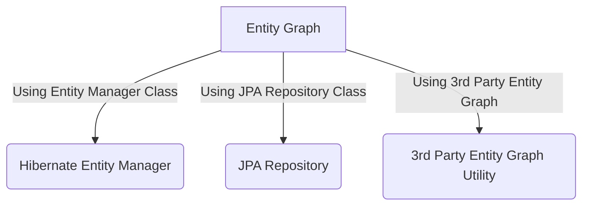
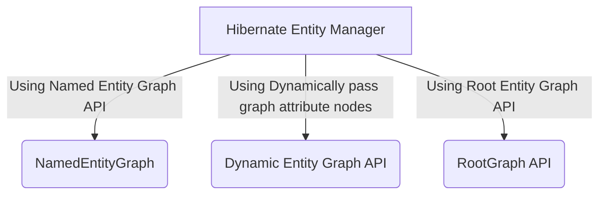

# Hibernate Entity Graph
 In Hibernate/JPA we face N+1 Problem. First we will see what is the N+1 Problem.
 
 In order to find, what is N+1 Problem Please go through the below stackoverflow link
 
 https://stackoverflow.com/questions/32453989/what-is-the-solution-for-the-n1-issue-in-jpa-and-hibernate?noredirect=1&lq=1
   
 We can fix N+1 select problem by using Entity Graphs provided by JPA 2.1. we can achieve it in the following ways. 
 
 - Using Entity Manager
 - Using JPA Repository
 - Using 3rd Party Entity Graph Utility
  



In this example we will use `Hibernate Entity Manager` to solve N+1 problem.



### DB Design


## Named Entity Graph

### Entity Class (declaring Named Entity Graph as below)

```java
@Entity
@Table(name = "author")
@NamedEntityGraph(name = "graph.author.books.publisher", 
	attributeNodes = @NamedAttributeNode(value = "books", subgraph = "books"),
	subgraphs = @NamedSubgraph(name = "books", attributeNodes = @NamedAttributeNode("publisher"))    )

@NamedEntityGraph(name = "graph.author.books", attributeNodes = @NamedAttributeNode(value = "books"))

public class Author {

	@Id
	@GeneratedValue(strategy = GenerationType.IDENTITY)
	private Integer id;

	@Version
	private Integer version;

	@Column(name = "first_name")
	private String firstName;

	@Column(name = "last_name")
	private String lastName;

	@ManyToMany(mappedBy="authors",fetch = FetchType.LAZY)
	private Set<Book> books = new HashSet<Book>();

}

@Entity
@Table(name = "book")
public class Book {
	
	@Id
	@GeneratedValue(strategy = GenerationType.IDENTITY)
	private Integer id;

	@Version
	private Integer version;

	private String title;

	@Temporal(TemporalType.DATE)
	@Column(name = "publishing_date")
	private Date publishingDate;

	@ManyToOne(fetch = FetchType.LAZY)
	@JoinColumn(name="publisher_id")
	private Publisher publisher;

	@ManyToMany
	@JoinTable(
		      name="book_author",
		      joinColumns={@JoinColumn(name="book_id", referencedColumnName="id")},
		      inverseJoinColumns={@JoinColumn(name="author_id", referencedColumnName="id")})
	private Set<Author> authors = new HashSet<Author>();
	
}

@Entity
@Table(name = "publisher")
public class Publisher {

	@Id
	@GeneratedValue(strategy = GenerationType.IDENTITY)
	private Integer id;

	@Version
	private Integer version;

	private String name;

	@OneToMany(mappedBy = "publisher")
	private Set<Book> books = new HashSet<Book>();
	
}		

```

### Named Entity Graph Testing Here

In this example we are using `@NamedEntityGraph` name attribute `graph.author.books` to get entity graph api. 
It will load only Books objects but not publisher associate with books

```java

	EntityManager entityManager = getEntityManager();
	String hql = "SELECT a FROM Author a WHERE a.id = 1";
	EntityGraph graph = entityManager.getEntityGraph("graph.author.books");
	TypedQuery<Author> query = entityManager.createQuery(hql, Author.class);
	query.setHint("javax.persistence.loadgraph", graph);
	Author author = query.getSingleResult();

```

In this example we are using `@NamedEntityGraph` name attribute `graph.author.books.publisher` to get entity graph api. 
It will load only Books objects as well as publisher associate with books

```java

	EntityManager entityManager = getEntityManager();
	String hql = "SELECT a FROM Author a WHERE a.id = 1";
	EntityGraph graph = entityManager.getEntityGraph("graph.author.books");		
	TypedQuery<Author> query = entityManager.createQuery(hql, Author.class);
	query.setHint("javax.persistence.loadgraph", graph);
	Author author = query.getSingleResult();

```

## Dynamic Entity Graph

### Entity Class

```java
@Entity
public class Author {

	@Id
	@GeneratedValue(strategy = GenerationType.IDENTITY)
	private Integer id;

	@Version
	private Integer version;

	@Column(name = "first_name")
	private String firstName;

	@Column(name = "last_name")
	private String lastName;

	@ManyToMany(mappedBy="authors",fetch = FetchType.LAZY)
	private Set<Book> books = new HashSet<Book>();


}

@Entity
@Table(name = "book")
public class Book {
	
	@Id
	@GeneratedValue(strategy = GenerationType.IDENTITY)
	private Integer id;

	@Version
	private Integer version;

	private String title;

	@Temporal(TemporalType.DATE)
	@Column(name = "publishing_date")
	private Date publishingDate;

	@ManyToOne(fetch = FetchType.LAZY)
	@JoinColumn(name="publisher_id")
	private Publisher publisher;

	@ManyToMany
	@JoinTable(
		      name="book_author",
		      joinColumns={@JoinColumn(name="book_id", referencedColumnName="id")},
		      inverseJoinColumns={@JoinColumn(name="author_id", referencedColumnName="id")})
	private Set<Author> authors = new HashSet<Author>();
	
}

@Entity
@Table(name = "publisher")
public class Publisher {

	@Id
	@GeneratedValue(strategy = GenerationType.IDENTITY)
	private Integer id;

	@Version
	private Integer version;

	private String name;

	@OneToMany(mappedBy = "publisher")
	private Set<Book> books = new HashSet<Book>();
	
}		

```

### Dynamic Entity Graph Testing Here

In this example we can set attributes dynamically. Graph API has  `addAttributeNodes(property name)` method to set property names.
We can set as many as attributesnodes to graph api. Here Author class has property name books. So we setting books attribute to graph.
It will load only Books objects but not publisher associate with books

```java

	String HQL ="SELECT a FROM Author a WHERE a.id = 1"; 
	EntityManager entityManager = getEntityManager();
	EntityGraph<Author> graph = entityManager.createEntityGraph(Author.class);
	graph.addAttributeNodes("books");
	TypedQuery<Author> query = entityManager.createQuery(HQL, Author.class);
	query.setHint("javax.persistence.loadgraph", graph);
	Author author = query.getSingleResult();

```

Graph API provide to add sub graph and its properties also, by using  `addSubgraph(property name)` and `addAttributeNodes(property name)`
Author class has property name `books` and Book class has property name `publisher` 
It will load only Books objects as well as publisher associate with books

```java

	EntityManager entityManager = getEntityManager();
	String HQL ="SELECT a FROM Author a WHERE a.id = 1"; 
	EntityGraph<Author> graph = entityManager.createEntityGraph(Author.class);
	graph.addSubgraph("books").addAttributeNodes("publisher");
	TypedQuery<Author> query = entityManager.createQuery(HQL, Author.class);
	query.setHint("javax.persistence.loadgraph", graph);
	Author author = query.getSingleResult();

```

## Root Entity Graph

### Entity Class

```java
@Entity
public class Author {

	@Id
	@GeneratedValue(strategy = GenerationType.IDENTITY)
	private Integer id;

	@Version
	private Integer version;

	@Column(name = "first_name")
	private String firstName;

	@Column(name = "last_name")
	private String lastName;

	@ManyToMany(mappedBy="authors",fetch = FetchType.LAZY)
	private Set<Book> books = new HashSet<Book>();


}

@Entity
@Table(name = "book")
public class Book {
	
	@Id
	@GeneratedValue(strategy = GenerationType.IDENTITY)
	private Integer id;

	@Version
	private Integer version;

	private String title;

	@Temporal(TemporalType.DATE)
	@Column(name = "publishing_date")
	private Date publishingDate;

	@ManyToOne(fetch = FetchType.LAZY)
	@JoinColumn(name="publisher_id")
	private Publisher publisher;

	@ManyToMany
	@JoinTable(
		      name="book_author",
		      joinColumns={@JoinColumn(name="book_id", referencedColumnName="id")},
		      inverseJoinColumns={@JoinColumn(name="author_id", referencedColumnName="id")})
	private Set<Author> authors = new HashSet<Author>();
	
}

@Entity
@Table(name = "publisher")
public class Publisher {

	@Id
	@GeneratedValue(strategy = GenerationType.IDENTITY)
	private Integer id;

	@Version
	private Integer version;

	private String name;

	@OneToMany(mappedBy = "publisher")
	private Set<Book> books = new HashSet<Book>();
	
}		

```

### Root Entity Graph Testing Here

In this example we need to create `RootGraph` object and pass all properties to load.

In this example, it will load only Books objects but not publisher associate with books

```java

	String HQL ="SELECT a FROM Author a WHERE a.id = 1"; 
	RootGraph<Author> graph = GraphParser.parse(Author.class, "books", entityManager);
	Map<String, Object> properties = new HashMap<String, Object>();
	properties.put("javax.persistence.loadgraph", graph);
	TypedQuery<Author> query = entityManager.createQuery(HQL, Author.class);
	Author author = query.getSingleResult();

```

In this example we need to create `RootGraph` object and pass all properties to load. Author class has property name `books` and Book class has property name `publisher` 

In this example, it will load only Books objects as well as publisher associate with books

```java

	String HQL ="SELECT a FROM Author a WHERE a.id = 1"; 
	RootGraph<Author> graph = GraphParser.parse(Author.class, "books(publisher)", entityManager);
	Map<String, Object> properties = new HashMap<String, Object>();
	properties.put("javax.persistence.loadgraph", graph);
	TypedQuery<Author> query = entityManager.createQuery(HQL, Author.class);
	Author author = query.getSingleResult();

```

