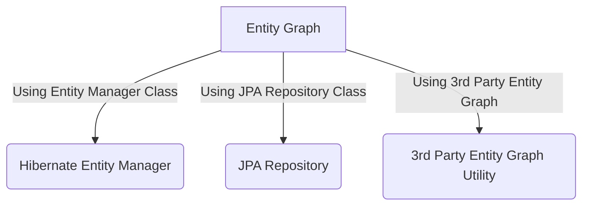

# Hibernate Entity Graph
 In Hibernate/JPA we face N+1 Problem. First we will see what is the N+1 Problem.
 
 In order to find, what is N+1 Problem Please go through the below links.
 
 https://www.tutorialandexample.com/hibernate-n-1-select-problem/
   
 In this example, we will discuss how to fix N+1 select problem by using Entity Graphs. 

- Using Entity Manager
- Using JPA Repository
- Using 3rd Party Entity Graph Utility

###FlowChart

